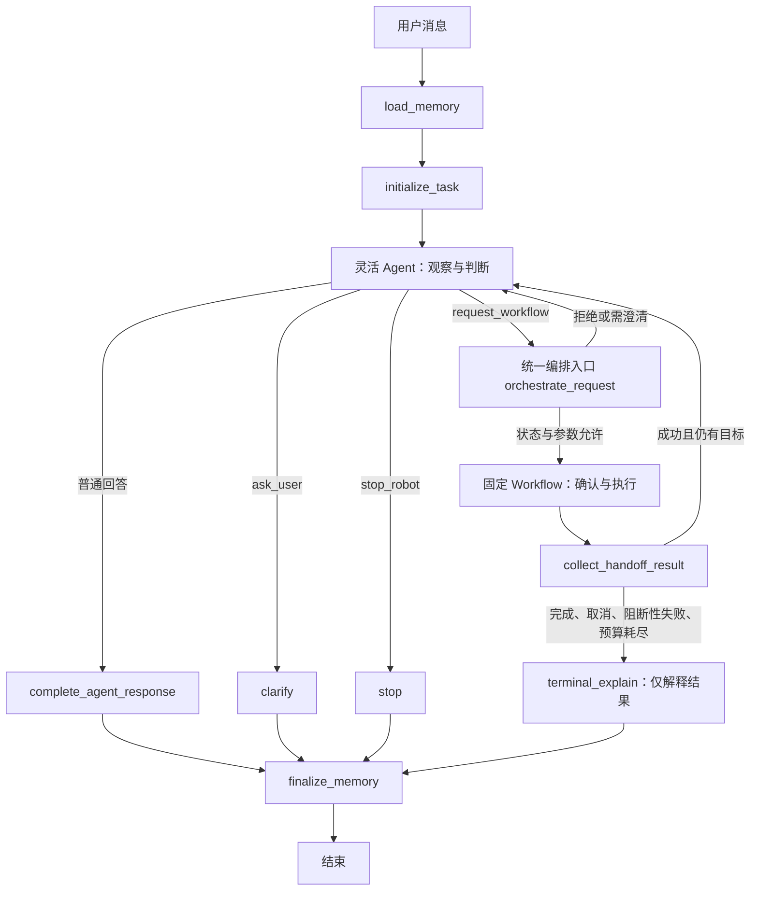

# 智能小车 car_agent 混合智能体设计（权威文档）

> 日期：2026-09-12
> 状态：目标设计；部分能力已实现，代码进度与阻塞见[实现交接文档](./car-agent-implementation-handoff.md)
> 范围：本仓库智能体的架构、责任边界、编排、状态、权限、确认、安全约束与验收；不涉及 ROS2 控制算法和硬件改造。
> 文档定位：本文是智能体设计的唯一权威来源。历史设计稿（`agent-architecture-plan.md`、
> `agent-routing-orchestration-plan.md`、`hybrid-agent-design.md`）已并入本文并从仓库移除，
> 需要追溯时从 Git 历史恢复。

## 1. 设计目标与不变量

项目采用 LangGraph + ROS2 混合架构：LangGraph 负责自然语言理解、固定 Workflow 编排、长期记忆
和人工确认；ROS2 负责传感器、定位、Nav2、避障与实时控制；二者通过本机 Robot Gateway 的
JSON/HTTP interface 连接。

设计保留以下不变量：

1. **有副作用、危险或需要明确执行边界的任务由固定 Workflow 完成**；问答、观察、解释和灵活判断
   由 Agent 完成。
2. **不增加多个自主执行智能体，也不让 Agent 直接控制机器人**。所有运动副作用都位于固定
   Workflow 和 Gateway implementation 中。
3. **取消、失败、重试和执行权限由代码约束，不依赖模型遵守提示词**。
4. **人工确认只能来自用户恢复输入**，模型不能生成有效确认。
5. 模型负责提出下一步，统一编排入口负责判断是否允许，Workflow 负责确定性执行。

本次优化的两个核心问题：

- Agent 观察后能够请求 Workflow，形成“观察 → 判断 → 确认 → 执行”的完整流程。
- 执行边界、预算和终态由代码固定；模型即使继续提出执行请求，终态任务也不会再次调用 Gateway。

## 2. 系统背景与责任分工

### 2.1 责任分工

| 组件 | 责任 |
| --- | --- |
| LangGraph Agent Server | 托管 graph、thread、run、checkpointer 和 Store |
| 灵活 Agent（官方 `create_agent`） | 首次判断、普通问答、观察与解释；只能提出结构化请求，不能直接控制机器人 |
| 统一编排入口 | 校验所有 Workflow 请求，决定放行、澄清或拒绝 |
| 固定 Workflow | 执行移动、跟随、位置变更和导航等有顺序、有副作用的任务 |
| Robot Gateway | 隐藏 ROS2 Action、Topic、定位质量、地图身份和错误归一化 |
| Nav2 与 Collision Monitor | 负责全局/局部规划、控制和最终碰撞防护 |
| Motion Controller | 执行短距离相对移动和目标跟随，只向 Agent 专用速度话题发布 |
| micro-ROS Agent | 承担 ROS2 与底层单片机之间的 DDS-XRCE 通信 |
| 单调 `/clock` 与 TimeMapper | 在 WSL 中提供统一、不回退的 ROS 时间，详见 [ROS 2 单调时间与仿真时间](./ROS2单调时间与仿真时间.md) |
| 安全规则 | 负责限值、超时、冲突急停和人工接管，不交给大模型判断 |

LangGraph 项目位于 `agents/car_agent`，与 `software/leap_ros_ws` 分别构建和运行。
Agent 代码不导入 `rclpy`、不创建 ROS Publisher，也不运行 ROS Executor。

### 2.2 总体结构

```text
用户 / LangSmith Studio / LangGraph SDK
                  │
                  ▼
       官方 LangGraph Agent Server
       ├─ PostgreSQL checkpoints
       └─ PostgreSQL Store / Memory
                  │
          START → load_memory
                  │
                  ▼
              Supervisor 主图
       ┌──────────┼───────────────┐
  灵活 Agent    统一编排入口    普通问答/急停
  （观察判断）      │            （直接短路/直接回答）
       │       固定 Workflows
       └───────┤  ├─ 相对移动
               │  ├─ 目标跟随
               │  ├─ 地图位置教学/删除
               │  └─ 命名地点 Nav2 导航
               │
               ▼
        finalize_memory → END
               │
               ▼ HTTP/JSON
          Robot Gateway
       ├─ ExecuteMotion Action
       ├─ FollowTarget Action
       ├─ ComputePathToPose Action
       ├─ NavigateToPose Action
       ├─ OccupancyGrid / AMCL
       └─ stop / camera / detections
               │
               ▼
        ROS2 / Nav2 / micro-ROS
```

## 3. 当前实现与已知限制

### 3.1 实现现状

第 6 节的目标拓扑已经实现：主图为 `load_memory → initialize_task → flexible_agent →
（orchestrate_request | stop | clarify | terminal_explain | complete_agent_response）`，
薄路由已移除，所有执行请求都经过统一编排入口。提交结果未知协议、跟随的两阶段确认、
稳定的步骤与 operation_id 也已落地。工作状态、验证结果与剩余工作以
[实现交接文档](./car-agent-implementation-handoff.md)为准，本文不重复维护。

历史基线（提交 `08d48670`）为“薄路由（`thin_router`）+ 固定子图 + 灵活 Agent”，
其判据问题（失败与取消靠提示词收敛、多工具消息配对不完整、候选选择兼作执行确认）
已在当前实现中修复。

### 3.2 能力完成矩阵

| 能力 | 状态 | 说明 |
| --- | --- | --- |
| 普通问答 | 已完成 | 默认中文回复 |
| 状态查询、急停 | 已完成 | 只读 Tool / 受限停止请求 |
| 相对移动 Workflow | 已完成 | 限值、确认、幂等、超时、状态未知 |
| 目标跟随 Workflow | 已完成 | YOLO 候选 → 执行确认两阶段、取消、状态未知 |
| 当前画面理解 | 已完成 | Gateway snapshot + 视觉模型 |
| PostgreSQL checkpoints | 已完成 | Agent Server 默认 backend，30 天 |
| 用户长期记忆 | 已完成 | Profile + 180 天 Episodes |
| LangSmith Studio Memory | 已接入 | 使用 Agent Server Store namespaces |
| 地图位置教学/删除 | 已完成 | robot/map 隔离，确认后写入 |
| 命名地点 Nav2 导航 | 已完成 | 预检、确认、执行、统计、状态未知 |
| 统一速度仲裁 | 已完成 | 100/150/200/255 + Collision Monitor |
| 观察到执行的编排闭环 | 已完成 | 统一编排入口 + 预算 + 终态收敛 |
| 显式停止事件（绕过模型） | 未实现 | 阶段四，需先核实宿主与 Gateway 契约 |
| 建图和地图保存 Workflow | 未实现 | 后续范围 |
| 巡逻与复合任务 Workflow | 未实现 | 后续范围 |
| 任务规划/诊断 Agent | 未实现 | 有真实需求后再增加 seam |
| 电量状态 | 未实现 | Gateway 当前未接入电量话题 |
| 多机器人调度 | 未实现 | 目前只完成数据作用域隔离 |

### 3.3 仍需注意的限制

- 任务进度采用渐进式粒度；模型提交当前步骤标题和成功后的剩余目标建议，代码仅在 Workflow
  成功时应用建议。已完成步骤必须有执行结果；计划标题的语义完整性仍依赖模型判断。
- 停车仍经过记忆加载与一次模型判断，是**对话停车入口**，不能据此宣称具备独立实时急停能力。
- 编排与观察依赖模型判断；预算只限制次数，不保证模型一定选择最优动作。
- 真机能力（AMCL/Nav2 精度、mux 冲突链、YOLO 跟随）尚未在整车上验收。

## 4. 权限与职责

“安全”需要落到能力权限上，而不只由任务名称判断。例如图片工具虽然不产生运动，仍须保留路径
白名单、大小限制和超时。

| 能力 | Agent 可直接调用 | 必须经过 Workflow |
| --- | --- | --- |
| 问答与结果解释 | 是 | 否 |
| 读取机器人状态、识别图片 | 是，受工具输入约束 | 否 |
| 相对移动、跟随、导航 | 否，只能提出任务请求 | 是 |
| 保存、覆盖、删除地图地点 | 否，只能提出任务请求 | 是 |
| 停止当前动作 | 通过受限停止请求进入独立停止入口 | 不等待普通执行确认 |

Agent 的工具集合只包含只读工具、`request_workflow`、`ask_user` 和 `stop_robot`；
终态解释节点不绑定任何工具。

## 5. 深模块与 seam

### 5.1 Memory 模块

Memory 模块对主图只暴露两个节点 interface：

```text
load(state, config, runtime)     → 记忆上下文
finalize(state, config, runtime) → 保存结果
```

它的 implementation 隐藏用户身份解析、namespace、语义检索、敏感信息清理、结构化提炼、
Profile 合并、TTL 和 embedding 降级。主图不创建 `PostgresStore` 或 `PostgresSaver`；
Agent Server 根据 `langgraph.json` 自动注入官方 checkpointer 与 Store。

每轮执行顺序固定为：

```text
START
→ 加载完整 Profile 与相关 Episodes
→ 把记忆作为“不可信背景”加入 Agent prompt
→ 正常问答或执行 Workflow
→ 提炼本轮稳定事实和摘要
→ 更新 Profile、写入 Episode
→ END
```

不得把 API Key、Token、密码、图片 Base64、原始 Tool JSON、瞬时坐标、速度或历史运动命令写入
用户长期记忆。提炼模型失败时只保存清理后的本轮摘要，不更新稳定 Profile。

长期记忆不能自动授权动作或复活历史任务；Agent 的摘要也不能成为执行进度的唯一保存位置。

### 5.2 LocationStore 模块

`LocationStore` 的 interface 提供当前地图内的位置列举、解析、保存、删除和结果统计。它隐藏
namespace、名称规范化、别名唯一性、语义召回和 embedding 失败降级。

位置资产只保存二维 Nav2 所需字段：

```json
{
  "label": "书桌前",
  "aliases": ["桌边"],
  "pose": {"x": 1.25, "y": -0.50, "yaw": 0.30, "frame_id": "map"},
  "map_id": "sha256:...",
  "robot_id": "xuegecar-01"
}
```

成功/失败次数、最后使用时间和 `needs_review` 可以变化，但**导航结果永不自动修正
`x/y/yaw`**。连续失败达到阈值后只标记复核。地图变化时不迁移、不转换、不复用旧坐标。

### 5.3 Workflow 模块

移动、跟随、位置和导航各自是固定 StateGraph。统一编排入口通过结构化请求传入任务参数，
Workflow 只返回压缩后的结构化结果；内部计划 ID、轮询状态和 ROS 记录不暴露给用户。

人工确认使用 LangGraph `interrupt()` 和 checkpoints。中断恢复会从节点开头重放，因此采样、
探测和提交任务等副作用与 `interrupt()` 分处不同节点；恢复后会重新检查安全前提。

### 5.4 RobotGateway seam

Agent 侧依赖 `RobotGateway` Protocol；生产 Adapter 是 `HttpRobotGateway`，测试 Adapter 是
`FakeRobotGateway`。调用方只了解结构化任务和稳定错误码，不了解 ROS2 类型、Executor 或
Action Future。

当前 HTTP interface：

| 方法与路径 | 用途 |
| --- | --- |
| `GET /v1/robot/status` | 融合里程计与活动任务状态 |
| `POST /v1/motions` | 提交短距离原子动作 |
| `GET /v1/motions/{id}` | 查询移动终态 |
| `POST /v1/follow-tasks` | 提交跟随任务 |
| `GET /v1/follow-tasks/{id}` | 查询跟随任务 |
| `POST /v1/follow-tasks/{id}/cancel` | 取消跟随 |
| `GET /v1/navigation/status` | 当前地图、AMCL 位姿与质量 |
| `POST /v1/navigation/preflight` | 静态净空与 ComputePathToPose |
| `POST /v1/navigation-tasks` | 提交 NavigateToPose |
| `GET /v1/navigation-tasks/{id}` | 查询导航终态 |
| `POST /v1/navigation-tasks/{id}/cancel` | 取消导航 |
| `POST /v1/stop` | 取消所有活动任务并急停 |
| `GET /v1/camera/snapshot` | 保存当前相机帧 |
| `GET /v1/perception/detections` | 获取当前 YOLO 检测快照 |

## 6. 目标架构

### 6.1 主图拓扑

**移除薄路由。** 灵活 Agent 负责首次判断；所有 Workflow 请求经统一编排入口做代码校验。
简单明确的运动请求也由 Agent 提出结构化请求，不再由路由节点直接生成执行参数。



要点：

1. **Agent 首次判断**：灵活 Agent 用官方 `create_agent`、`SummarizationMiddleware` 和上下文
   中间件，承载只读工具与控制工具（`request_workflow`、`ask_user`、`stop_robot`）。
2. **统一编排入口**：只有它可以把请求送进固定 Workflow；校验失败回到 Agent 澄清。
3. **固定 Workflow 不变**：保留既有参数校验、`interrupt()` 确认、幂等提交和轮询。
4. **终态解释阶段必须禁用委派能力**，且不得仅通过提示词要求 Agent 不再发起任务，必须由代码
   边界（工具集合/中间件）保证。
5. Agent 原始工具调用不展示；允许通过 `task_progress` 展示总目标和步骤标题，这些展示内容
   不授予执行权限。执行确认仍只由 Workflow 提供。

### 6.2 Workflow 请求协议

建议请求包含：

| 字段 | 含义 |
| --- | --- |
| kind | 枚举：motion、follow、save_location、delete_location、navigation |
| arguments | 对应 Workflow 的严格输入模型，拒绝未知字段 |
| source_observation_ids | 可选，支持此次判断的观察引用 |
| step_description | 当前步骤的简短中文标题，用于任务列表展示 |
| remaining_goals_after_success | 此步成功后的待完成步骤标题列表；最后一步为 `[]` |

`task_id`、`step_id`、请求编号和执行版本由代码生成。模型不能填写确认状态、执行下标、
`operation_id` 或内部控制字段。

必须复用现有 `MotionAction`、`FollowRequest`、`NavigationRequest` 等输入约束。导航继续只接受
地点名称，不接受模型生成的坐标。`source_observation_ids` 如果提供，必须属于当前任务；来源
引用只用于追踪依据，**不等于授权**，也不能替代 Workflow 的实时检查。

请求信封先由 `WorkflowSubmission` 严格校验，非对象参数、非法列表和未知字段返回澄清，不在
中间件中强行执行 `dict(...)` 或 `list(...)` 转换。业务参数再由对应 Workflow 模型校验。

### 6.2.1 静态 Workflow 描述表

`supervisor/workflow_registry.py` 集中登记每种类型的参数模型、输入准备函数、目标节点、结果
字段和默认标题。编排入口查表完成校验、调度和结果读取，不再分别维护三组类型分支。
未知类型和缺失结果均明确失败，不回落到导航等其他 Workflow。

新增类型需要新增 Workflow 实现和描述记录，同时补齐工具允许类型、提示词、图节点注册和
测试。图构建检查描述表中的目标节点已注册，收集结果的边按描述表自动添加。此处不是动态
插件框架；确认、提交、轮询和恢复逻辑仍由各 Workflow 独立实现。

统一入口检查顺序：

1. 当前任务未取消、未结束，且没有冲突的执行中步骤。
2. 请求类型在允许集合内，输入符合对应模型。
3. 前置步骤成功，没有未处理的失败。
4. 未超过委派、重试及整体交互预算。
5. 请求未被作为同一次步骤重复处理。
6. 进入 Workflow，执行其预检与用户确认。

不按“参数相同”直接去重：用户可能确实要求连续两次相同动作。去重应针对同一个任务步骤或恢复
重放。Agent 返回多个控制调用时，全部拒绝并生成配对完整的拒绝消息，不执行其中任意一个副作用
工具。

### 6.3 示例：看到杯子后跟随

1. 用户：“看看有没有杯子，有的话跟随它。”
2. Agent 获取当前画面并识别，决定是否请求跟随。
3. 有杯子：提出 `follow(target_label="cup")` 请求。
4. 跟随 Workflow 重新读取实时 YOLO 检测，解析目标并请求确认。
5. 用户确认后执行；没有检测到目标则按候选选择或失败流程处理。
6. 结果回到统一入口，更新状态并向用户解释。

视觉语言模型的识别结果不能替代跟随 Workflow 的实时检测。当前跟随接口按类别工作，不能承诺在
多个同类对象中跟随某个指定实例。

## 7. 任务状态与进度

### 7.1 状态字段

保留现有 Workflow 内部状态，在主图增加轻量任务记录，避免把完整计划系统作为第一阶段前提。

| 字段 | 含义 |
| --- | --- |
| `schema_version` | 状态版本，当前为 3；不兼容旧 checkpoint，包括版本 2 和无版本号数据 |
| `task_id` | 代码生成的当前任务标识 |
| `goal` | 当前用户目标，不能被工具内容静默替换 |
| `task_status` | active、awaiting_input、running、completed、cancelled、failed、budget_exhausted |
| `current_step` / `completed_steps` | 当前步骤及其状态、已完成步骤与结果引用 |
| `remaining_goals` | 尚未完成的目标，可逐步细化 |
| `task_progress` | 公共展示投影：总目标、任务状态、步骤列表、完成数和停止原因 |
| `stop_reason` | 终止原因，供最终回复使用 |
| `dispatch_count` | 实际委派次数（默认上限 5） |
| `retry_count` | 当前步骤恢复/重试次数（默认上限 1） |
| `observation_count` | 观察次数（默认上限 3） |
| `observations` | 观察记录，供 `source_observation_ids` 引用 |
| `pending_workflow_request` / `pending_clarification` | 待恢复的请求与待澄清问题 |
| `last_workflow_result` | 最近一次 Workflow 结果，供解释与分流 |

完成状态只能依据工具或 Workflow 结果更新；模型可以建议后续目标，但不能把未执行动作标成完成。
任务记录采用渐进式粒度，不预先生成完整计划。

当前步骤保存 `description` 和 `remaining_goals_after_success`，后者在确认恢复、去重重放时绑定
原步骤。仅成功结果写入 `completed_steps` 并应用剩余目标建议；取消、失败、预算耗尽和状态
未知不应用建议。未提供建议时保留原目标，普通文本回复不能清空有执行步骤的未完成目标。

`task_progress` 是从这些代码记录派生的公共输出，不能由调用者输入或独立改写执行状态。
步骤按“已完成 → 当前 → 待完成”排序，支持前端展示如下结构（这轮未实现网页任务列表）：

```text
总目标：先前进 1 米，再后退 1 米
  ✓ 前进 1 米
  ◉ 后退 1 米
```

每次只请求当前步骤。待完成标题只是模型的计划建议，不代表已经预检、确认或执行。

### 7.2 生命周期与 task_id 边界

- 新用户任务开始时初始化记录；同一任务的确认恢复不能重置进度和计数。
- 任务为 `awaiting_input` 时，下一条用户消息延续原 `task_id`。
- `completed`、`cancelled`、`failed`、`budget_exhausted` 后的用户消息创建新任务，不继承旧任务的
  `completed_steps`、计数或 pending 请求。
- 新任务、澄清回答、确认恢复和停止请求应区分处理。
- **旧 checkpoint 不迁移、不自动删除**：主图 `stream` / `astream` 调用入口读取存量 checkpoint，
  缺少版本号或版本不匹配时抛出 `IncompatibleCheckpointError`，要求新会话。普通新输入、
  `Command(resume=...)` 和空输入恢复都先检查，拒绝时不调用模型/Gateway，也不写回旧状态。
  没有存量 checkpoint 的新会话才允许初始化版本；初始化节点另保留旧字段的防御检查。

## 8. 上下文与长期记忆

### 8.1 上下文策略

- 编排输入包含当前用户目标、任务状态、必要的最近消息，不再只依赖固定数量切片。
- 灵活 Agent 继续使用官方 `SummarizationMiddleware` 压缩累积历史，不重写完整 Agent loop。
- 裁剪消息时保持 AI 工具调用与 ToolMessage 配对完整（工具消息成组裁剪）。
- 长期记忆继续作为不可信背景资料。
- 编排若需要用户偏好，只注入相关的结构化背景，不把全部历史记忆塞入提示词。
- 任务上下文以可信结构注入 Agent，与不可信的长期记忆区分开。

### 8.2 Checkpoints 与持久化

采用“Agent Server 托管 PostgreSQL 持久化”：Agent Server 负责初始化和维护数据库表，并在运行时
向 graph 注入 checkpointer 和 Store。PostgreSQL 是唯一持久数据源；Redis 只用于运行中队列、
取消和流式事件。

本机数据库使用独立容器、独立 volume，并只绑定 `127.0.0.1:5433`。完整启动方式见
[Agent Server PostgreSQL 持久化](../agents/car_agent/PERSISTENCE.md)。

### 8.3 数据作用域与生命周期

| 数据 | Namespace / 范围 | 生命周期 |
| --- | --- | --- |
| checkpoints | `thread_id` | `keep_latest`，30 天 |
| 用户档案 | `users/<user_id>/profile/current` | 永久 |
| 对话摘要 | `users/<user_id>/episodes/<run_id>` | 180 天 TTL |
| 地图位置 | `robots/<robot_id>/maps/<map_id>/locations/<key>` | 永久，显式删除 |

用户身份优先级：Agent Server 已认证身份 → `configurable.user_id` → `CAR_AGENT_USER_ID` →
`local-user`。机器人身份来自 `configurable.robot_id` 或 `CAR_ROBOT_ID`。

地图位置不属于用户 namespace：多个用户可以为同一机器人和同一地图教学地点，但任何用户都不能
从另一张地图召回坐标。

### 8.4 地图身份

Gateway 对 OccupancyGrid 的以下内容做稳定 SHA-256：

- width、height、resolution；
- origin 的 x、y、yaw；
- 完整 occupancy data。

只要地图几何或任一栅格发生变化，`map_id` 就不同。位置查询只打开当前
`robots/<robot_id>/maps/<map_id>/locations` namespace，不在查询后再依赖模型过滤。

### 8.5 语义索引

Store 使用宿主机 Ollama 的 `qwen3-embedding:0.6b`，维度固定为 1024，索引字段为：

```text
summary, important_facts, label, aliases
```

Profile 不做向量索引；Episodes 和地点可语义检索。Ollama 暂时不可用时，数据仍以 `index=False`
保存，精确名称和别名继续可用。

## 9. 业务 Workflow 设计约束

### 9.1 短距离移动

相对移动接受前进、后退、左转和右转的结构化动作列表。距离、角度和时间有固定范围；缺少数值时
必须询问，超范围直接拒绝。Workflow 确认后通过 `ExecuteMotion` 串行执行，不允许模型循环发布
`/cmd_vel`。确认绑定整段动作序列，顺序或数值变化使确认失效。

### 9.2 目标跟随

Agent 把用户目标转换为单个 YOLO COCO 英文类别。Workflow 先获取检测快照；目标命中时展示最终
目标并单独确认后提交 `FollowTarget`，未命中时列出候选并让用户选择。**候选选择与执行确认必须
分两步**：用户选中候选不能隐含开始执行。跟随最长 300 秒，由 ROS 控制节点闭环发布 Agent 速度。

### 9.3 图像理解

用户提供本地路径时读取允许目录内的图片；询问“当前画面”时由 Gateway 抓取相机最新帧。视觉模型
只描述和判断，不直接控制底盘。当前实现是直接 Tool，不是独立视觉 Agent。

### 9.4 地点教学、更新和删除

只有用户明确说“记住/记录当前位置为某地点”时，才允许提出位置 Workflow 请求。普通聊天、模型
推断和历史记忆均不得自动创建坐标。

```text
显式教学请求
→ 读取当前 OccupancyGrid + AMCL pose
→ 校验地图与定位质量
→ 查找当前地图同名/别名位置
→ interrupt 展示 map、x、y、yaw 和更新差异
→ 用户确认
→ 重新读取地图与 pose
→ 地图必须相同，位置移动 ≤ 0.10 m，yaw 变化 ≤ 10°
→ 写入 Store
```

确认前小车若明显移动，或者地图变化，旧确认立即失效。删除同样限制在当前地图并要求确认，且
确认具体对象，避免确认后名称解析到不同对象。

确认绑定 `location_existing` 的完整对象快照。提交时重新精确解析原名称/别名并比较快照；对象
被修改、删除、名称被占用或别名被重新分配时，原确认作废，终止变更并要求重新选择确认。
删除使用已确认对象的稳定 key；按别名覆盖时更新已确认的规范名称，不创建一个别名同名对象。
`LocationStore` 的变更方法也校验期望快照。当前 Store 契约没有原子 CAS，因此此检查不构成
跨进程并发事务保证；若要求严格避免最后一次检查与写入之间的竞争，需后续增加事务/CAS。

### 9.5 命名地点导航

```text
用户说“走到书桌前”
→ 获取当前 map_id 与 AMCL pose
→ 仅在当前 robot/map namespace 解析标准名称与别名
→ 无精确结果时进行语义召回
→ 多个候选时 interrupt 要求选择
→ 校验 AMCL 新鲜度和协方差
→ 检查目标点及圆形净空区域
→ 调用 ComputePathToPose
→ interrupt 展示地点和 x/y/yaw，单独确认导航
→ 确认后重新检查 map_id
→ 幂等提交 NavigateToPose
→ 轮询终态；超时取消并停车
→ 只更新成功/失败统计，不修改坐标
```

“保存位置”的确认不能代替“开始导航”的确认。Gateway 还拥有独立导航超时，即使 Agent 断连也会
取消超时 goal 并锁止速度输出。

## 10. 失败、取消与重试

主图归一化结果类型，同时保留各 Workflow 的原始领域错误码。

| 结果 | 确定性处理 |
| --- | --- |
| success | 更新完成记录；有剩余目标且预算允许时继续 |
| cancelled | 当前任务进入终态，不自动重试或再次委派 |
| invalid_request | 未执行；解释参数问题或等待用户澄清 |
| failed | 默认终止当前复合任务，报告已完成和未完成部分 |
| execution_unknown | 先查询执行记录确认状态，禁止盲目重提运动 |
| budget_exhausted | 结束自动编排，明确报告未完成事项 |

第一阶段默认串行，任何执行失败都停止后续步骤。后续确实需要“失败后继续独立步骤”时，再引入
显式依赖关系与策略。

重试原则：

- 只读查询可按错误类型有限重试。
- 有副作用请求提交超时，不能推断为未执行。必须用**同一 `operation_id`** 查询：查询成功则继续
  轮询原任务；`NOT_FOUND` 才能判定没有找到提交记录；查询仍不可用时返回 `execution_unknown`。
  禁止换新 ID 盲目重提运动。
- 参数、目标或动作范围发生实质变化时，需要重新确认。
- 用户取消不属于可重试错误。
- 操作失败与执行状态未知必须区分，不能统一描述为“小车没有移动”。

## 11. 确认语义

确认绑定具体任务步骤、执行参数和必要的环境条件，不能只保存一个跨步骤复用的布尔值。

建议规则：

- 移动：确认整段动作序列；动作顺序或数值变化使确认失效。
- 跟随：候选选择与执行确认分开，必须明确显示“选择即开始执行”时才允许合并交互。
- 导航：确认目标地点与对应地图；保留执行前地图重检。
- 地点保存和覆盖：确认名称、坐标及覆盖对象；保留恢复后的地图和位姿复检。
- 地点删除：确认具体对象。

确认后的执行前重检必须发生在 Workflow 内，不能让 Agent 自行判断旧确认是否仍然有效。

## 12. 停止与运行中打断

自然语言停车由 Agent 提出受限停止请求，代码直接进入 `stop` 节点，不经过 Workflow 确认。
当前 `stop` 节点仍依赖前置记忆加载，它是对话停车入口，**不能据此宣称具备独立实时急停能力**。

独立停止是后续需验证宿主能力的专项，不应在本文设计中假定已经具备。建议目标：

1. UI 或调用端提供显式停止事件，可直接进入停止处理器，不等待语言模型。
2. 停止不仅调用 Gateway，也把当前任务标记为取消，阻止后续步骤重新启动运动。
3. 与运行中的 Workflow 协调取消，处理“停止发生时某次提交尚未返回”的竞争情况。
4. 停止响应如实区分“已发出请求”和“已确认停止”。

自然语言中的“停”仍需要语义理解，不能用简单关键词匹配替代，例如“不要停”。实施前需要确认
Agent Server 的并发运行、取消和恢复行为，以及 Gateway 的停止契约。

## 13. 统一速度仲裁与安全（部署约束）

所有速度源必须进入 `twist_mux`，不得绕过它直接发布最终 `/cmd_vel`：

```text
Nav2 velocity_smoother → /cmd_vel_nav    (priority 100) ─┐
Motion / Follow       → /cmd_vel_agent  (priority 150) ─┤
人工遥控              → /cmd_vel_teleop (priority 200) ─┼→ twist_mux
急停锁                → /cmd_vel_emergency_lock (255) ─┘
                                                        │
                                                        ▼
                                              /cmd_vel_selected
                                                        │
                                                        ▼
                                               Collision Monitor
                                                        │
                                                        ▼
                                                    /cmd_vel
```

Jazzy 的 `twist_mux` 已显式配置 `use_stamped: false`，与当前 Motion Controller 和 Nav2 的
`geometry_msgs/Twist` 一致；输出使用绝对 remap `/cmd_vel_out → /cmd_vel_selected`。
`xuegecar_bringup/control_core.launch.py` 是 mux 和 Collision Monitor 的唯一所有者；
Gateway、Navigation2 和 Web GUI 只按需包含该核心，不再各自创建 mux。
twist_mux 固定使用系统时间计算输入和锁心跳超时，不跟随 `/clock`；这样单调时钟节点停止时，
0.5 秒急停看门狗仍能继续计时并锁止输出。

统一仲裁规则：

1. 急停锁 255：遮蔽所有速度源；Motion Controller 每 0.1 秒发送心跳，心跳超时也进入锁止。
2. 人工控制 200：覆盖 Agent 与 Nav2。
3. Agent 移动/跟随 150：覆盖 Nav2。
4. Nav2 100：最低自主控制优先级。
5. Gateway 全局任务槽不允许移动、跟随和导航并行。
6. 若检测到 `/cmd_vel_agent` 与 `/cmd_vel_nav` 同时存在非零指令，按冲突处理，
   Gateway 通过 `/motion/set_emergency_lock` 服务触发急停锁。
7. Collision Monitor 位于 mux 下游，是到达底盘前的最终碰撞防护。
8. `POST /v1/stop` 无需模型确认，会取消活动 Action、触发急停并保持最高优先级锁。

运行时应使用以下命令审计最终速度话题，确保 `/cmd_vel` 只有 Collision Monitor 一个 publisher：

```bash
ros2 topic info /cmd_vel -v
```

## 14. 实施约束与依赖

- 本文定义目标设计；标注“已完成”的能力才表示代码已经具备。
- 保留既有 Workflow、参数校验、地图隔离、图片访问限制和统一速度仲裁。
- 第一阶段不引入自主并行运动、任意代码执行或 Agent 直接调用 Gateway。
- 优先实现代码级取消和失败边界，再开放新的自动编排路径。
- 依赖：`langchain>=1.0,<2.0`（官方 `create_agent`、`SummarizationMiddleware` 所在）；
  不重写完整 Agent loop，继续使用官方中间件。
- 不兼容旧 checkpoint，不提供迁移，通过 `schema_version` 拒绝恢复并要求新会话。
- 是否合并跟随选择与确认、是否减少模型调用，可根据实际交互和耗时决定，不影响前两阶段实施。
- 已知根因风险：模型接口慢/超时是“卡在编排”的直接原因之一，分层重构**不直接解决**该根因，
  需要正交缓解（请求超时、流式输出、失败降级、最小裁剪兜底）。

## 15. 分阶段实施

### 阶段一：固定控制边界（已实现）

- 引入最小任务状态和结果分流。
- 取消、执行失败、预算耗尽后强制进入终态解释。
- 修复多工具消息配对。
- 保留现有四类 Workflow 的正常执行路径。

完成标准：模型即使继续提出执行请求，终态任务也不会再次调用 Gateway。

### 阶段二：打通观察与执行（已实现）

- 新增受限 Workflow 请求协议。
- 接入统一校验入口，支持 Agent 观察后委派。
- 将结构化结果反馈给 Agent，允许成功后的下一步判断。
- 限制观察调用、委派和重试预算，防止新增闭环无界运行。

完成标准：“先观察，满足条件再执行”的场景能在同一任务完成，并经过原有 Workflow 确认。

### 阶段三：完善任务进度和确认（已实现）

- 补充剩余目标与明确的终止原因。
- 改进上下文裁剪及工具消息保留。
- 统一候选选择与确认语义，拆分跟随的候选选择与执行确认。
- 完善恢复去重和提交结果未知（`execution_unknown`）时的处理。
- 完成旧 checkpoint 拒绝和新任务初始化测试。

### 阶段四：独立停止与性能优化（待办）

- 在宿主和 Gateway 契约核实后接入显式停止事件。
- 验证运行中取消和停止后的后续步骤阻断。
- 记录各阶段耗时，再决定是否优化普通问答的模型调用。

## 16. 验收场景与验证状态

### 16.1 验收场景

| 场景 | 预期 |
| --- | --- |
| 普通问答 | 正常回答，不访问运动接口 |
| 查询状态 | 调用状态工具；正确区分相对里程计和地图位姿 |
| 看到杯子后跟随 | Agent 观察后委派；Workflow 重新检测并等待确认 |
| 没有杯子 | 解释观察结果，不擅自跟随其他类别 |
| 第一段动作成功，再导航 | 完成记录更新；导航独立预检和确认 |
| 用户取消第一步 | 任务终止，不继续剩余步骤或重新请求同一步 |
| 第一段动作失败 | 报告已完成部分与失败原因，不继续后续步骤 |
| 提交请求超时 | 不直接认定未执行，不生成新操作编号盲目重试 |
| 确认后地图或执行参数变化 | 原确认失效，不按旧确认执行新任务 |
| 同一步 checkpoint 恢复 | 保持操作标识，验证不会重复运动 |
| 用户明确要求两次相同动作 | 两步均可执行，不被参数去重误删 |
| 模型输出多个委派调用 | 全部拒绝且消息配对完整，不产生运动 |
| 达到预算但目标未完成 | 明确列出未完成事项，不宣称全部完成 |
| 历史记忆包含旧运动命令 | 不生成新的执行授权 |
| 运行中收到显式停止事件 | 请求停止、任务取消，剩余步骤被阻断 |
| 旧 checkpoint 恢复 | 被拒绝，要求新会话 |

单元测试验证状态转移和工具调用边界；少量真实模型集成测试验证消息协议及 Agent 请求接口。
真机验证应另行安排，不能用假 Gateway 测试替代实际幂等和停止能力验证。

### 16.2 验证状态

本轮阶段三修复验证（2026-09-13）：

- 单元测试 **135 passed**（含新增 41 项回归）；Ruff、格式检查和 mypy（42 个源文件）通过。
  这轮不调用真实模型或车辆。
- 新增回归覆盖多工具整组裁剪、真实无版本 checkpoint 的调用/恢复拒绝、非法请求信封、
  剩余目标成功后更新、总目标与步骤展示，以及确认期间地点对象/别名变化。
- 沙箱内最小 `asyncio.to_thread` 示例会停滞，测试运行器临时将 selector 的单次等待限制为
  50 ms 后完成异步验证；未修改生产线程调用或持久化实现。普通运行器与真实宿主仍需复核。

上一轮改造记录（2026-09-12，历史结果，非本轮重测）：

- Agent 测试：96 passed（94 单元 + 2 真实模型集成），无挂起。
- Agent Ruff（lint 与格式）：通过。
- Agent mypy：通过（39 个源文件）。
- 真实模型协议验证：按编排协议产出合法请求并停在人工确认。

上一轮基线（2026-09-01）的历史结果：

- Agent 单元测试：58 passed。
- Agent Ruff：通过。
- Agent mypy：通过。
- Gateway HTTP、地图指纹、AMCL 质量和栅格净空测试：通过。
- `xuegecar_agent_bridge` 与 `xuegecar_navigation2`：colcon build 通过。
- 当前两个 ROS 包测试：25 passed。
- PostgreSQL 17 `pgvector/pgvector:pg17` 容器：健康，绑定 `127.0.0.1:5433`。
- `ros-jazzy-twist-mux`：已安装，配置可正确加载四个输入及其消息类型。

仍需在真实整车运行时完成以下验收：

1. 在 Agent Server + LangSmith Studio 中跨 thread 验证 Profile、Episodes 和 Locations 可见并可召回。
2. 在 Ollama 实际运行时验证 `qwen3-embedding:0.6b` 的 1024 维索引。
3. 用真实 AMCL 与地图验证位置教学、地图切换隔离和 NavigateToPose 到达精度。
4. 同时注入各速度源，验证 mux 优先级、冲突锁和 Collision Monitor 的完整 DDS 数据链。
5. 审计最终 `/cmd_vel` publisher，确认没有任何绕过仲裁的节点。

## 17. 后续演进路线

1. **真实闭环验收**：完成上述 Studio、地图、导航和速度链验证。
2. **建图 Workflow**：启动/停止 SLAM、保存地图、切换地图；所有覆盖操作必须确认。
3. **有限复合任务**：实现“导航—观察—返回”，仍由固定 Workflow 编排。
4. **巡逻与异常报告**：加入执行预算、取消、断点恢复和人工接管。
5. **诊断能力**：积累真实失败样本后，再决定是否增加诊断 Agent。

适合作为下一阶段首个整车闭环：

> 用户明确教学“这里是书桌前”，确认保存；切换新 thread 后说“走到书桌前”，系统从当前地图的
> 长期记忆召回坐标，完成定位与路径预检，再次确认后通过 Nav2 到达并停车。

该场景同时验证 PostgreSQL 长期记忆、LangSmith Memory、地图隔离、interrupt/checkpoint 恢复、
Nav2、统一速度仲裁和执行反馈。

## 18. 参考文档

- [LangGraph Agent Server](https://docs.langchain.com/langsmith/agent-server)
- [LangGraph CLI 与 Store 配置](https://docs.langchain.com/langsmith/cli)
- [LangGraph Persistence](https://docs.langchain.com/oss/python/langgraph/persistence)
- [LangGraph Interrupts](https://docs.langchain.com/oss/python/langgraph/interrupts)
- [LangGraph Long-term memory](https://docs.langchain.com/oss/python/langchain/long-term-memory)
- [LangGraph Semantic search](https://docs.langchain.com/langsmith/semantic-search)
- [twist_mux](https://docs.ros.org/en/jazzy/p/twist_mux/)
- 仓库内其他文档：[ROS 2 单调时间与仿真时间](./ROS2单调时间与仿真时间.md)、
  [Agent Server PostgreSQL 持久化](../agents/car_agent/PERSISTENCE.md)、
  [导航使用指南](./导航使用指南.md)、[建图使用指南](./建图使用指南.md)、
  [启动小车](./启动小车.md)、[Web 上位机测试指南](./Web上位机测试指南.md)
- 参考实现：`references/intelligent_customer_service`

## 附录 A：关键决策记录

| # | 决策点 | 结论 | 理由 |
| --- | --- | --- | --- |
| 1 | 路由职责 | 移除薄路由，Agent 首次判断 | 路由与执行分层但多一跳模型调用；Agent 已具备判断能力 |
| 2 | 工具执行层 | 固定高成本→Workflow；灵活可扩展→Agent | Workflow 保住确认中断，Agent 好扩展 |
| 3 | `stop_robot` | 受限停止请求直接进入 `stop` 节点 | 安全紧急，必须最低延迟 |
| 4 | 编排控制流 | 顺序 + 条件分支，按结果动态重排（渐进式） | 未来任务需根据中间结果调整顺序 |
| 5 | Agent 实现 | 官方 `create_agent` + `SummarizationMiddleware` | 官方 agent loop + 官方上下文压缩，不重写 |
| 6 | Workflow 对接 | Workflow 留外层 StateGraph，Agent 只提出结构化请求 | 避免把带 `interrupt` 的子图包装成扁平工具 |
| 7 | 权限校验位置 | 统一编排入口按 Pydantic 模型重新校验 | 权限由代码约束，不依赖提示词 |
| 8 | 预算 | 委派 ≤5、单步恢复/重试 ≤1、观察 ≤3 | 防止自动闭环无界运行 |
| 9 | 任务延续 | `awaiting_input` 延续 `task_id`，终态后新建 | 区分澄清回答与新任务 |
| 10 | checkpoint 兼容 | 不兼容旧状态，`schema_version` 拒绝 | 迁移成本高于新会话成本 |
| 11 | 提交结果未知 | 同一 `operation_id` 查询，否则 `execution_unknown` | 禁止盲目重提运动 |
| 12 | 上下文 | Agent 用官方中间件；记忆保持 profile + episode | 上下文按能力下沉，记忆机制稳定复用 |

## 附录 B：已废弃与被取代的设计

以下内容来自历史设计稿，仅作追溯，不再是有效规范：

- **厚路由（2026-09-01 及以前）**：单个 supervisor 节点读取全量消息、自行选工具并现场生成执行
  参数（如 `delegate_to_motion_workflow` 的 `actions` 列表）。已由分层架构取代。
- **薄路由 `thin_router`（2026-09-02 实施）**：路由只做意图分类 + 急停短路，固定子图保留，
  灵活 Agent 承载只读工具，随后增加路由循环多步编排（`router_steps` + `ROUTER_MAX_STEPS`）。
  **该方案已于 2026-09-12 被取代**：薄路由整体移除，改由 Agent 首次判断 + 统一编排入口校验。
  与之绑定的环境变量 `ROUTING_MESSAGE_COUNT`、`ROUTER_MAX_STEPS` 不再适用；
  `SUMMARIZE_TRIGGER_TOKENS`、`SUMMARIZE_KEEP_MESSAGES` 仍用于 Agent 的
  `SummarizationMiddleware`。
- **“保留薄路由”的设计表述**：历史稿 `hybrid-agent-design.md` 第 4.1 节的“保留薄路由，新增
  统一决策入口”已被第 6 节取代。
- **跟随“候选选择兼作执行确认”**：历史实现与设计中的合并交互已废弃，改为候选选择与执行确认
  两阶段。
- **阶段 0（正交缓解）**：给旧 supervisor 加超时/流式/最小裁剪兜底，未实施；其风险判断仍然
  有效，见第 14 节。
