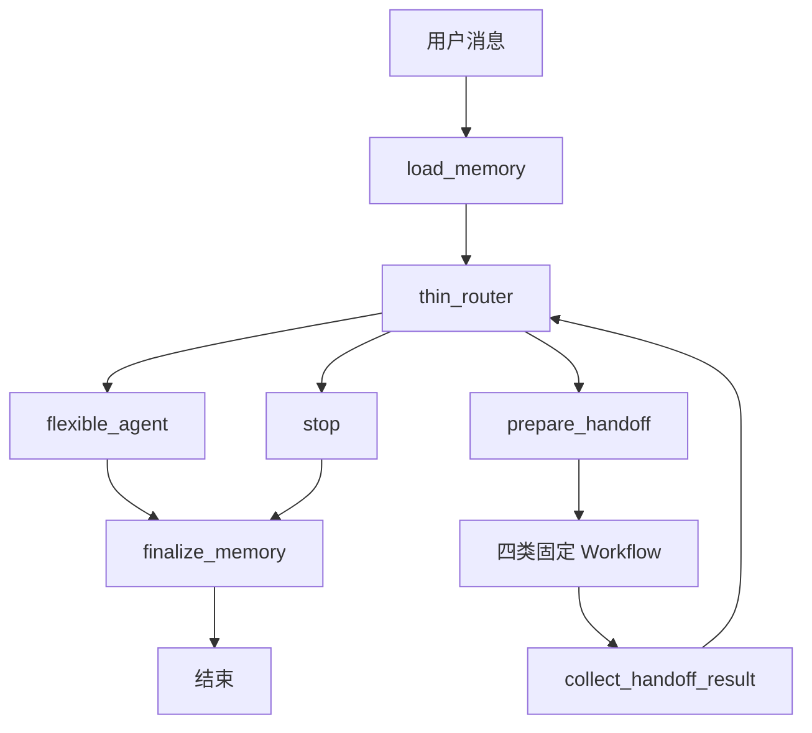
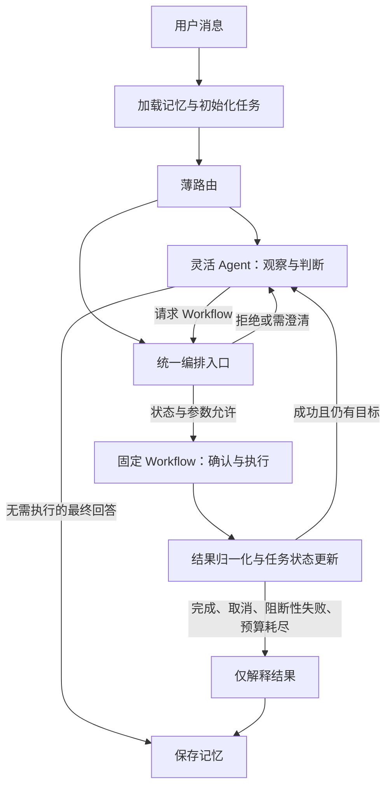

# 混合智能体优化设计

日期：2026-09-12  
状态：设计建议，尚未实现  
范围：本仓库智能体的编排、状态、权限、确认与测试；不涉及 ROS2 控制算法和硬件改造。

## 1. 设计目标

保留当前混合架构：有副作用、危险或需要明确执行边界的任务由固定 Workflow 完成；问答、观察、解释和灵活判断由 Agent 完成。

本次优化不增加多个自主执行智能体，也不让 Agent 直接控制机器人。重点解决两个问题：

1. Agent 观察后能够请求 Workflow，形成“观察 → 判断 → 确认 → 执行”的完整流程。
2. 取消、失败、重试和执行权限由代码约束，不依赖模型遵守提示词。

以下接口名称和字段都是建议，实施时可结合现有类型调整。

## 2. 当前实现与边界

### 2.1 当前主流程

核心入口为 `src/agent/supervisor/graph.py`。

| 模块 | 已实现职责 |
| --- | --- |
| thin_router | 最近消息内进行意图判断，一次选择一个委派或停车工具，默认最多 5 步 |
| flexible_agent | 普通问答、状态查询、图片识别、Workflow 结果解释；带长期记忆注入和历史摘要 |
| motion Workflow | 参数校验、整段计划确认、动作串行执行、终态轮询 |
| follow Workflow | YOLO 检测、类别匹配或候选选择、确认、提交跟随任务 |
| location Workflow | 地点保存或删除，确认后重新校验地图；保存时检查位姿变化 |
| navigation Workflow | 当前地图内解析地点、路径预检、确认、导航提交与轮询 |
| Memory | 用户档案和摘要按用户隔离；地点资产按机器人和地图隔离 |
| RobotGateway | HTTP 客户端接口，实际机器人控制和服务端幂等实现不在本仓库内 |

### 2.2 当前主要限制

- `flexible_agent` 完成后直接进入 `finalize_memory`，观察结果不能在本轮继续驱动 Workflow。
- Workflow 的失败、取消结果仍返回路由器，是否继续主要依赖提示词。
- 任务进度主要存在消息历史中；`router_steps` 只限制次数，不描述剩余目标。
- 路由器不接收 `memory_context`，只读取裁剪后的消息。
- 跟随候选选择兼作执行确认；导航候选选择与执行确认分开，交互语义不一致。
- 路由返回多个工具调用时，拒绝分支只补一个 ToolMessage，消息配对不完整。
- 停车经过记忆加载和路由模型；它是对话停车入口，不能据此宣称具备独立实时急停能力。

上述结论来自静态阅读，未做真实模型、Agent Server 或真机联调验证。

## 3. 权限与职责

“安全”需要落到能力权限上，而不只由任务名称判断。例如图片工具虽然不产生运动，仍须保留路径白名单、大小限制和超时。

| 能力 | Agent 可直接调用 | 必须经过 Workflow |
| --- | --- | --- |
| 问答与结果解释 | 是 | 否 |
| 读取机器人状态、识别图片 | 是，受工具输入约束 | 否 |
| 相对移动、跟随、导航 | 否，只能提出任务请求 | 是 |
| 保存、覆盖、删除地图地点 | 否，只能提出任务请求 | 是 |
| 停止当前动作 | 通过独立停止入口处理 | 不等待普通执行确认 |

模型负责提出下一步。统一编排入口负责判断是否允许；Workflow 负责确定性执行。人工确认只能来自用户恢复输入，模型不能生成有效确认。

## 4. 目标架构

### 4.1 保留薄路由，新增统一决策入口

薄路由用于本轮初始能力分流。简单明确的运动请求仍可直接委派；需要观察和推理的请求进入 Agent。

Agent 通过一个受限的结构化委派工具提出 Workflow 请求。该工具只提交请求，不调用机器人、不直接写入执行状态。具体用工具调用拦截还是结构化输出实现，应在编码时先验证当前 `create_agent` 的消息和恢复机制，再固定一种方案。

终态解释阶段必须禁用委派能力。不得仅通过提示词要求 Agent 不再发起任务。

### 4.2 Workflow 请求协议

建议请求包含：

| 字段 | 含义 |
| --- | --- |
| kind | 枚举：motion、follow、save_location、delete_location、navigation |
| arguments | 对应 Workflow 的严格输入模型，拒绝未知字段 |
| source_observation_ids | 可选，支持此次判断的观察引用 |

`task_id`、`step_id`、请求编号和执行版本由代码生成。模型不能填写确认状态、执行下标、operation_id 或内部控制字段。

必须复用现有 MotionAction、FollowRequest、NavigationRequest 等输入约束。导航继续只接受地点名称，不接受模型生成的坐标。来源引用只用于追踪依据，不代表观察一定可靠或仍然新鲜。

统一入口检查顺序：

1. 当前任务未取消、未结束，且没有冲突的执行中步骤。
2. 请求类型在允许集合内，输入符合对应模型。
3. 前置步骤成功，没有未处理的失败。
4. 未超过委派、重试及整体交互预算。
5. 请求未被作为同一次步骤重复处理。
6. 进入 Workflow，执行其预检与用户确认。

不按“参数相同”直接去重：用户可能确实要求连续两次相同动作。去重应针对同一个任务步骤或恢复重放。

### 4.3 示例：看到杯子后跟随

1. 用户：“看看有没有杯子，有的话跟随它。”
2. Agent 获取当前画面并识别，决定是否请求跟随。
3. 有杯子：提出 `follow(target_label="cup")` 请求。
4. 跟随 Workflow 重新读取实时 YOLO 检测，解析目标并请求确认。
5. 用户确认后执行；没有检测到目标则按候选选择或失败流程处理。
6. 结果回到统一入口，更新状态并向用户解释。

视觉语言模型的识别结果不能替代跟随 Workflow 的实时检测。当前跟随接口按类别工作，不能承诺在多个同类对象中跟随某个指定实例。

## 5. 任务状态与进度

保留现有 Workflow 内部状态，在主图增加轻量任务记录，避免把完整计划系统作为第一阶段前提。

| 字段 | 建议含义 |
| --- | --- |
| task_id | 代码生成的当前任务标识 |
| goal | 当前用户目标，不能被工具内容静默替换 |
| status | active、awaiting_input、running、completed、cancelled、failed、budget_exhausted |
| current_step | 当前步骤及其状态 |
| completed_steps | 已完成步骤与结果引用 |
| remaining_goals | 尚未完成的目标，可逐步细化 |
| stop_reason | 终止原因，供最终回复使用 |
| dispatch_count | 实际委派次数 |
| retry_count | 当前步骤重试次数 |

完成状态只能依据工具或 Workflow 结果更新；模型可以建议后续目标，但不能把未执行动作标成完成。

新用户任务开始时初始化记录；同一任务的确认恢复不能重置进度和计数。新任务、澄清回答、确认恢复和停止请求应区分处理。

### 5.1 上下文策略

- 路由输入包含当前用户目标、任务状态、必要的最近消息，不再只依赖固定数量切片。
- 裁剪消息时保持 AI 工具调用与 ToolMessage 配对完整。
- 长期记忆继续作为不可信背景资料，不能自动授权动作或复活历史任务。
- Agent 的摘要不能成为执行进度的唯一保存位置。
- 编排若需要用户偏好，只注入相关的结构化背景，不把全部历史记忆塞入路由提示。

## 6. 失败、取消与重试

建议主图归一化结果类型，同时保留各 Workflow 的原始领域错误码。

| 结果 | 确定性处理 |
| --- | --- |
| success | 更新完成记录；有剩余目标且预算允许时继续 |
| cancelled | 当前任务进入终态，不自动重试或再次委派 |
| invalid_request | 未执行；解释参数问题或等待用户澄清 |
| failed | 默认终止当前复合任务，报告已完成和未完成部分 |
| execution_unknown | 先查询执行记录确认状态，禁止盲目重提运动 |
| budget_exhausted | 结束自动编排，明确报告未完成事项 |

第一阶段默认串行，任何执行失败都停止后续步骤。后续确实需要“失败后继续独立步骤”时，再引入显式依赖关系与策略。

重试原则：

- 只读查询可按错误类型有限重试。
- 有副作用请求提交超时，不能推断为未执行；应使用同一 operation_id 查询或交由服务端幂等处理。
- 参数、目标或动作范围发生实质变化时，需要重新确认。
- 用户取消不属于可重试错误。
- 操作失败与执行状态未知必须区分，不能统一描述为“小车没有移动”。

## 7. 确认语义

确认绑定具体任务步骤、执行参数和必要的环境条件，不能只保存一个跨步骤复用的布尔值。

建议规则：

- 移动：确认整段动作序列；动作顺序或数值变化使确认失效。
- 跟随：默认将候选选择与执行确认分开。若保留合并交互，必须明确显示“选择即开始执行”。
- 导航：确认目标地点与对应地图；保留执行前地图重检。
- 地点保存和覆盖：确认名称、坐标及覆盖对象；保留恢复后的地图和位姿复检。
- 地点删除：确认具体对象，避免确认后名称解析到不同对象。

确认后的执行前重检必须发生在 Workflow 内，不能让 Agent 自行判断旧确认是否仍然有效。

## 8. 停止与运行中打断

当前 `stop` 节点跳过普通确认和灵活 Agent，但仍依赖前置记忆加载与路由模型。独立停止是后续需验证宿主能力的专项，不应在本次设计中假定已经具备。

建议目标：

1. UI 或调用端提供显式停止事件，可直接进入停止处理器，不等待语言模型。
2. 停止不仅调用 Gateway，也把当前任务标记为取消，阻止后续步骤重新启动运动。
3. 与运行中的 Workflow 协调取消，处理“停止发生时某次提交尚未返回”的竞争情况。
4. 停止响应如实区分“已发出请求”和“已确认停止”。

自然语言中的“停”仍需要语义理解，不能用简单关键词匹配替代，例如“不要停”。实施前需要确认 Agent Server 的并发运行、取消和恢复行为，以及 Gateway 的停止契约。

## 9. 具体代码改动建议

| 文件或模块 | 建议改动 |
| --- | --- |
| `src/agent/supervisor/graph.py` | 新增统一请求校验和结果状态分流；打通 Agent 到 Workflow；终态禁用委派 |
| `src/agent/state/car_agent.py` | 增加任务目标、进度、终止原因和预算字段 |
| `src/agent/tools/` | 增加只提交结构化任务请求的接口；保留工具权限隔离 |
| `src/agent/workflows/` | 保留固定流程；逐步统一结果分类、确认语义和恢复边界 |
| `src/agent/memory/nodes.py` | 区分新任务与恢复；任务状态不依赖摘要；终态记忆写入保持可降级 |
| `tests/unit_tests/test_supervisor.py` | 增加协作闭环、取消、失败、去重、预算和消息配对测试 |
| 各 Workflow 测试 | 增加确认失效、执行状态未知和恢复重放用例 |

优先修复现有多工具异常分支：对每个工具调用生成对应拒绝结果，确保工具消息完整配对。此类协议异常不应执行其中任意一个副作用工具；独立停止事件走自己的处理路径。

## 10. 分阶段实施

### 阶段一：固定控制边界

- 引入最小任务状态和结果分流。
- 取消、执行失败、预算耗尽后强制进入终态解释。
- 修复多工具消息配对。
- 保留现有四类 Workflow 的正常执行路径。

完成标准：模型即使继续提出执行请求，终态任务也不会再次调用 Gateway。

### 阶段二：打通观察与执行

- 新增受限 Workflow 请求协议。
- 接入统一校验入口，支持 Agent 观察后委派。
- 将结构化结果反馈给 Agent，允许成功后的下一步判断。
- 限制观察调用、委派和重试预算，防止新增闭环无界运行。

完成标准：“先观察，满足条件再执行”的场景能在同一任务完成，并经过原有 Workflow 确认。

### 阶段三：完善任务进度和确认

- 补充剩余目标与明确的终止原因。
- 改进上下文裁剪及工具消息保留。
- 统一候选选择与确认语义。
- 完善恢复去重和提交结果未知时的处理。

### 阶段四：独立停止与性能优化

- 在宿主和 Gateway 契约核实后接入显式停止事件。
- 验证运行中取消和停止后的后续步骤阻断。
- 记录各阶段耗时，再决定是否减少普通问答的路由调用。

## 11. 验收场景

| 场景 | 预期 |
| --- | --- |
| 普通问答 | 正常回答，不访问运动接口 |
| 查询状态 | 调用状态工具；正确区分相对里程计和地图位姿 |
| 看到杯子后跟随 | Agent 观察后委派；Workflow 重新检测并等待确认 |
| 没有杯子 | 解释观察结果，不擅自跟随其他类别 |
| 第一段动作成功，再导航 | 完成记录更新；导航独立预检和确认 |
| 用户取消第一步 | 任务终止，不继续剩余步骤或重新请求同一步 |
| 第一段动作失败 | 报告已完成部分与失败原因，不继续后续步骤 |
| 提交请求超时 | 不直接认定未执行，不生成新操作编号盲目重试 |
| 确认后地图或执行参数变化 | 原确认失效，不按旧确认执行新任务 |
| 同一步 checkpoint 恢复 | 保持操作标识，验证不会重复运动的服务端契约 |
| 用户明确要求两次相同动作 | 两步均可执行，不被参数去重误删 |
| 模型输出多个委派调用 | 全部拒绝且消息配对完整，不产生运动 |
| 达到预算但目标未完成 | 明确列出未完成事项，不宣称全部完成 |
| 历史记忆包含旧运动命令 | 不生成新的执行授权 |
| 运行中收到显式停止事件 | 请求停止、任务取消，剩余步骤被阻断 |

单元测试验证状态转移和工具调用边界；少量真实模型集成测试验证消息协议及 Agent 请求接口。真机验证应另行安排，不能用假 Gateway 测试替代实际幂等和停止能力验证。

## 12. 实施约束

- 本文只定义设计建议，不表示代码已经具备这些能力。
- 保留既有 Workflow、参数校验、地图隔离和图片访问限制。
- 第一阶段不引入自主并行运动、任意代码执行或 Agent 直接调用 Gateway。
- 优先实现代码级取消和失败边界，再开放新的自动编排路径。
- 是否减少薄路由调用、是否合并跟随选择与确认，可根据实际交互和耗时决定；不影响前两阶段实施。
